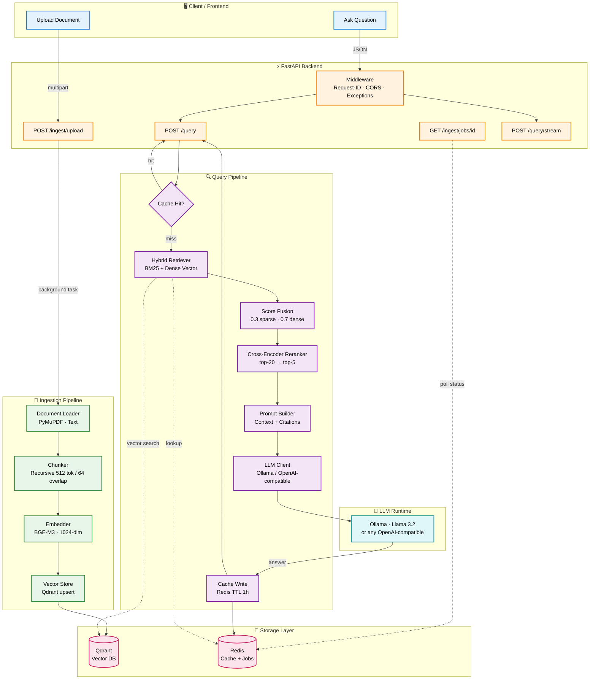

# 🏗️ Production RAG Pipeline — Architecture

> A production-grade Retrieval-Augmented Generation backend built with **FastAPI** and a **100% open-source** stack.

[](https://www.python.org/downloads/)
[](https://fastapi.tiangolo.com/)
[](https://qdrant.tech/)
[](LICENSE)

---

## 📖 Table of Contents

- [Overview](#-overview)
- [Architecture Diagram](#-architecture-diagram)
- [Data Flow](#-data-flow)
- [Ingestion Pipeline](#-ingestion-pipeline)
- [Query Pipeline](#-query-pipeline)
- [Component Reference](#-component-reference)
- [Folder Structure](#-folder-structure)
- [API Endpoints](#-api-endpoints)
- [Tech Stack](#-tech-stack)
- [Design Decisions](#-design-decisions)
- [Running Locally](#-running-locally)

---

## 🎯 Overview

This backend implements an end-to-end **document RAG pipeline**:

1. **Ingest** documents (PDF, text) → parse → chunk → embed → store
2. **Query** with natural language → hybrid retrieval → reranking → grounded LLM answer with citations

**Key guarantees:**

| Guarantee | Mechanism |
|---|---|
| Answers grounded in your documents | Prompt enforces context-only responses |
| Precise citations | Chunk metadata carries `source` + `page` |
| No hallucination on missing info | Explicit abstention path |
| Fast repeat queries | Redis semantic cache (70–90% latency reduction) |
| Vendor independence | LLM provider abstraction |
| Consistent error responses | Global exception hierarchy |
| Full observability | Structured JSON logs + request-ID correlation |

---

## 🗺️ Architecture Diagram



---

## 🔄 Data Flow

### Ingestion Flow

```
Upload → Validate → Save to disk → Background task
                                        │
                                        ▼
                          Load (PyMuPDF) → Chunk (512/64)
                                        │
                                        ▼
                          Embed (BGE-M3) → Upsert (Qdrant)
                                        │
                                        ▼
                          Update job status (Redis)
```

### Query Flow

```
Question → Cache lookup (Redis)
              │
              ├─── HIT ──► Return cached answer
              │
              └─── MISS ──► Hybrid Retrieval (BM25 + Vector)
                                │
                                ▼
                          Score Fusion (0.3 / 0.7)
                                │
                                ▼
                          Cross-Encoder Rerank (top-20 → top-5)
                                │
                                ▼
                          Build Prompt with Citations
                                │
                                ▼
                          LLM Generation (streaming or sync)
                                │
                                ▼
                          Cache write → Return answer + sources
```

---

## 📥 Ingestion Pipeline

| Stage | Component | Technology | Why |
|-------|-----------|------------|-----|
| **1. Load** | `DocumentLoader` | PyMuPDF (fitz) | Fastest PDF parser, preserves layout + page numbers for citations |
| **2. Chunk** | `Chunker` | RecursiveCharacterTextSplitter | Respects paragraph/sentence boundaries — better embeddings than fixed windows |
| **3. Embed** | `Embedder` | BGE-M3 (Sentence-Transformers) | Multilingual, 8K context, 1024-dim, Apache 2.0 |
| **4. Store** | `VectorStore` | Qdrant | Best payload filtering, sub-5ms latency, self-hostable |

**Chunk configuration:**
- Size: `512` tokens
- Overlap: `64` tokens (preserves context across boundaries)
- Separators tried in order: `\n\n` → `\n` → `. ` → ` ` → `""`

**Metadata preserved per chunk:**
```json
{
  "source": "uploads/refund_policy.pdf",
  "page": 3,
  "chunk_index": 17,
  "file_type": "pdf"
}
```

---

## 🔍 Query Pipeline

### Stage-by-stage breakdown

#### 1. Cache Lookup
- Key: `SHA-256(normalized_query)`
- TTL: 3600 seconds (configurable)
- Failure mode: **non-fatal** — cache miss is treated as a normal miss

#### 2. Hybrid Retrieval

| Retriever | Strength | Weight |
|---|---|---|
| **BM25** (sparse) | Exact keyword matches — names, codes, jargon | 0.3 |
| **Dense vector** | Semantic similarity — synonyms, paraphrases | 0.7 |

Results are **normalized to [0,1]** then combined via weighted sum, so neither retriever dominates due to score magnitude differences.

#### 3. Cross-Encoder Reranking

Bi-encoders (embedding models) encode query and document **independently** — they lose interaction signal. Cross-encoders read **query + document together**, producing much more accurate relevance scores.

- Model: `cross-encoder/ms-marco-MiniLM-L-6-v2`
- Input: top-20 candidates from hybrid retrieval
- Output: top-5 highest-scoring chunks

#### 4. Prompt Construction

Every prompt enforces:
1. **Grounding** — only use the provided context
2. **Citations** — `[n]` markers for each source
3. **Abstention** — explicit message when context is insufficient
4. **Concision** — no rambling

#### 5. Generation

- Default: **Ollama** (local, fully open-source)
- Alternative: any **OpenAI-compatible** endpoint (vLLM, LM Studio, TGI)
- Supports **streaming** via Server-Sent Events

---

## 🧩 Component Reference

| Component | File | Responsibility |
|---|---|---|
| Config | `app/core/config.py` | Type-safe env vars via Pydantic Settings |
| Logging | `app/core/logging.py` | Structured JSON logs + request-ID correlation |
| Exceptions | `app/core/exceptions.py` | Domain exception hierarchy + global handlers |
| Loader | `app/core/loader.py` | PDF/text → `Document` objects |
| Chunker | `app/core/chunker.py` | Recursive splitting with overlap |
| Embedder | `app/core/embedder.py` | BGE-M3 wrapper |
| Vector Store | `app/core/vector_store.py` | Qdrant client operations |
| Retriever | `app/core/retriever.py` | Hybrid BM25 + vector search |
| Reranker | `app/core/reranker.py` | Cross-encoder scoring |
| LLM Client | `app/core/llm_client.py` | Provider abstraction |
| Prompts | `app/core/prompts.py` | Grounding-enforcing templates |
| Ingestion Service | `app/services/ingestion_service.py` | Orchestrates load→chunk→embed→store |
| Retrieval Service | `app/services/retrieval_service.py` | Orchestrates retrieve→rerank |
| Generation Service | `app/services/generation_service.py` | Orchestrates prompt→LLM |
| Cache Service | `app/services/cache_service.py` | Redis read/write 
---

## 🌐 API Endpoints

### Ingestion

| Method | Path | Description |
|---|---|---|
| `POST` | `/ingest/upload` | Upload a document (multipart) → returns `job_id` |
| `GET` | `/ingest/jobs/{job_id}` | Poll ingestion status |

**Example:**

```bash
curl -X POST http://localhost:8000/ingest/upload \
  -F "file=@refund_policy.pdf"
```

```json
{
  "job_id": "a1b2c3d4-...",
  "status": "queued",
  "message": "Document uploaded. Poll /ingest/jobs/{job_id} for status."
}
```

### Query

| Method | Path | Description |
|---|---|---|
| `POST` | `/query` | Sync JSON answer + sources |
| `POST` | `/query/stream` | Server-Sent Events streaming |

**Example (sync):**

```bash
curl -X POST http://localhost:8000/query \
  -H "Content-Type: application/json" \
  -d '{"query": "What is the refund policy?"}'
```

```json
{
  "answer": "Our refund policy allows returns within 30 days [1].",
  "sources": [{"source": "uploads/refund_policy.pdf", "page": 1}],
  "cached": false
}
```

**Example (streaming):**

```
data: {"type":"sources","sources":[{"source":"refund_policy.pdf","page":1}]}

data: {"type":"token","text":"Our"}

data: {"type":"token","text":" refund"}

data: {"type":"token","text":" policy"}

data: {"type":"done"}
```

### Health

| Method | Path | Purpose |
|---|---|---|
| `GET` | `/health` | Liveness (process up?) |
| `GET` | `/health/ready` | Readiness (deps reachable?) |
| `GET` | `/health/startup` | Startup probe for K8s |

---

## 🧰 Tech Stack

| Layer | Technology | License |
|---|---|---|
| Web Framework | FastAPI | MIT |
| ASGI Server | Uvicorn | BSD |
| Config | Pydantic Settings | MIT |
| PDF Parsing | PyMuPDF | AGPL |
| Chunking | LangChain Text Splitters | MIT |
| Embedding | BGE-M3 (sentence-transformers) | Apache 2.0 |
| Vector DB | Qdrant | Apache 2.0 |
| Sparse Retrieval | rank-bm25 | Apache 2.0 |
| Reranker | ms-marco-MiniLM-L-6-v2 | Apache 2.0 |
| Cache | Redis | BSD |
| LLM Runtime | Ollama | MIT |
| Containerization | Docker + Compose | Apache 2.0 |

**100% open-source. No proprietary APIs required.**

---

## 🧠 Design Decisions

### Why hybrid retrieval (BM25 + vector) instead of pure vector?

Dense embeddings are excellent at semantics but weak at **exact matches** — order codes, product SKUs, proper nouns. BM25 is the inverse. Fusing both improves recall on real-world queries, which mix semantic and keyword intent.

### Why cross-encoder reranking?

Bi-encoder similarity is fast but coarse — it compares embeddings, not the actual text. A cross-encoder reads query + document **jointly**, producing far more accurate relevance scores. Applied only to top-20 candidates, so latency stays acceptable.

### Why cache failures are non-fatal

Redis is a **soft dependency**. If it goes down, queries still succeed — just slower. This is why `CacheError` is caught and downgraded to a cache miss, and why `/health/ready` still returns 200 when Redis is unreachable.

### Why liveness and readiness are separate

If `/health` checked Qdrant and Qdrant was briefly down, Kubernetes would kill a perfectly healthy pod — causing a cascading restart storm. Liveness checks only the process; readiness checks dependencies.

### Why LLM provider is abstracted

Swapping from Ollama → vLLM → OpenAI-compatible is a **config change**, not a code change. This is critical for experimentation and avoiding vendor lock-in.

### Why chunking uses 512 tokens with 64 overlap

- **512 tokens** fits comfortably in the BGE-M3 context window and keeps chunks semantically focused.
- **64 tokens overlap** preserves context across boundaries, preventing sentences from being split mid-thought.

### Why metadata carries `source` and `page`

Answers must be **verifiable**. Every retrieved chunk carries its origin file and page, so the LLM can produce citations the user can actually check.

---

## 🚀 Running Locally

### Prerequisites

- Docker + Docker Compose
- Ollama (running on host) **or** an OpenAI-compatible endpoint
- Python 3.11+ (for local dev without Docker)

### One-command start

```bash
docker compose -f docker/docker-compose.yml up --build
```

This starts:
- **Qdrant** on `:6333`
- **Redis** on `:6379`
- **FastAPI** on `:8000`

### Pull an LLM (if using Ollama)

```bash
ollama pull llama3.2
ollama serve
```

### Ingest a document

```bash
curl -X POST http://localhost:8000/ingest/upload \
  -F "file=@./sample.pdf"
```

### Ask a question

```bash
curl -X POST http://localhost:8000/query \
  -H "Content-Type: application/json" \
  -d '{"query": "What does the document say about refunds?"}'
```

### Interactive API docs

Open **http://localhost:8000/docs** for the auto-generated Swagger UI.

---

## 📊 Roadmap

- [x] Hybrid retrieval (BM25 + vector)
- [x] Cross-encoder reranking
- [x] Semantic caching
- [x] Streaming responses (SSE)
- [x] Exception hierarchy + global handlers
- [x] Structured logging + request correlation
- [x] Health / readiness / startup probes
- [ ] Frontend (React + Vite)
- [ ] Evaluation with RAGAS
- [ ] Multi-tenant document isolation
- [ ] Celery-based distributed ingestion
- [ ] Prometheus metrics + Grafana dashboard

---

## 📄 License

MIT — see [LICENSE](../LICENSE) for details.

---

## 🙏 Acknowledgements

Built on the shoulders of giants:

- [FastAPI](https://fastapi.tiangolo.com/)
- [Qdrant](https://qdrant.tech/)
- [BGE-M3](https://huggingface.co/BAAI/bge-m3)
- [Sentence-Transformers](https://www.sbert.net/)
- [Ollama](https://ollama.com/)
- [Redis](https://redis.io/)

---

<p align="center">
  <b>⭐ Star the repo if this helped you build your own RAG system!</b><br/>
  <a href="https://github.com/Varuntejakulla/Production-RAG-pipeline">github.com/Varuntejakulla/Production-RAG-pipeline</a>
</p>